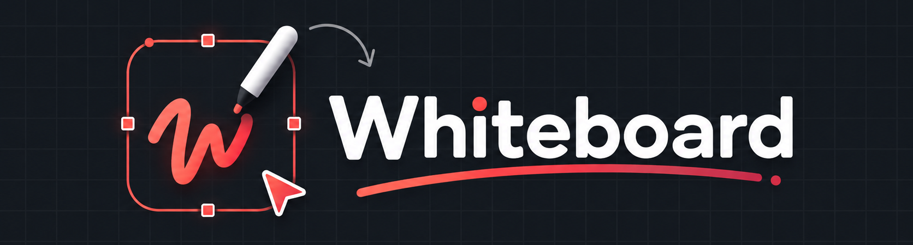

# Whiteboard


[](https://github.com/samdoom-coder/whiteboard/blob/main/LICENSE)

A fast, client-side whiteboarding app with a hand-drawn aesthetic. Sketch shapes, connect arrows, drop in images, and turn plain-text ideas into structured diagrams — all in your browser.

Everything runs locally in your browser. Documents are autosaved to `localStorage`, and there is no account required. For **real-time collaboration**, an optional tiny WebSocket relay server brokers shared rooms between peers.

## ✨ Features

### Drawing
- **12 tools** — selection, rectangle, rounded rectangle, ellipse, diamond, line, arrow, pencil (freehand), text, image, eraser, and pan/hand.
- **Hand-drawn rendering** — organic, sketch-style strokes with adjustable roughness for that whiteboard feel.
- **Connectors that stick** — arrows bind to shapes and stay attached as you move or resize them.
- **Rich styling** — per-element stroke color, fill color, fill style (solid / hachure / crosshatch), stroke width, line style (solid / dashed / dotted), opacity, and roughness.
- **Text** — multi-line editing with font family, size, bold, and alignment controls.
- **Images** — upload, drag & drop, or paste image files straight onto the canvas.

### Canvas
- **Infinite canvas** — scroll, pan (wheel, space-drag, middle-mouse, touch), pinch-to-zoom, and trackpad zoom.
- **Backgrounds** — plain, grid, or dots, with a palette of colors.
- **Smart contrast** — grid lines, dots, and the default drawing color automatically switch between light and dark to stay readable on whatever background you choose.
- **Dark / light mode** — the entire UI themes cleanly, including the tool palette and menus.

### Workflow
- **Undo / redo** with 120-step history.
- **Multi-select** — click, shift-click, marquee, and select-all; move, resize, rotate, and reorder (front / back / forward / backward) freely.
- **Copy / paste / duplicate**.
- **Command palette** (`Ctrl/⌘ + K`) and a full set of **keyboard shortcuts**.
- **Minimap** for navigating large boards.
- **Templates** — jump-start with AWS Architecture, System Architecture, ER Diagram, Flowchart, Mind Map, Mobile Wireframe, or Business Process diagrams.
- **AI assistant** — describe a system in plain English (e.g. *"mobile app → API gateway → backend with PostgreSQL, Redis, S3"*) and it generates an architecture diagram on the canvas.
- **Exports** — PNG (with scale), SVG, and JSON; import JSON documents back anytime.
- **Autosave** — changes are persisted automatically and restored on the next visit.
- **Real-time collaboration** — share an invite link and draw together live. Peers see each other's changes instantly, presence shows who's in the room, and the room state is handed to late joiners on arrival.
- **Live cursors** — every collaborator's pointer is rendered on the canvas with their name, anchored to the board across different pan/zoom views.

## 🚀 Getting Started

Requires **Node.js 20+**.

```bash
npm install
npm run dev
```

Then open the URL printed by Vite (default `http://localhost:5173`).

### Real-time collaboration

Start the relay server in a second terminal (it needs to be reachable by every participant, e.g. a machine on your LAN or a small VPS):

```bash
npm run server      # WebSocket relay on ws://0.0.0.0:8787
```

Then hit the **Share** button (top bar) to start a session and copy the invite link — anyone who opens it joins the same room automatically. Override the relay URL with the `VITE_WS_URL` env var if it doesn't run on `localhost:8787`.

## 🧰 Scripts

| Command            | Description                              |
| ------------------ | ---------------------------------------- |
| `npm run dev`      | Start the Vite dev server with HMR       |
| `npm run server`   | Start the realtime collaboration relay   |
| `npm run build`    | Type-check (`tsc -b`) and build for prod |
| `npm run preview`  | Preview the production build             |
| `npm run lint`     | Lint with Oxlint                         |

## 🧱 Tech Stack

- **[React 19](https://react.dev)** + **[TypeScript](https://www.typescriptlang.org/)**
- **[Vite](https://vite.dev)** — build tooling
- **[Zustand](https://github.com/pmndrs/zustand)** — lightweight global state
- **[Oxlint](https://oxc.rs)** — linting
- **[ws](https://github.com/websockets/ws)** — WebSocket relay for realtime collaboration
- Custom **Canvas 2D renderer** — hand-drawn geometry, arrows, selection overlays, and zoom/pan are all implemented from scratch (no canvas library)

## ⌨️ Keyboard Shortcuts

| Action              | Shortcut                |
| ------------------- | ----------------------- |
| Selection           | `V`                     |
| Shapes (rect / rounded / ellipse / diamond) | `R` `E` `D` |
| Line / Arrow        | `L` `A`                 |
| Pencil / Text / Hand| `P` `T` `H`            |
| Undo / Redo         | `Ctrl/⌘ + Z` / `Ctrl/⌘ + Shift + Z` or `Ctrl/⌘ + Y` |
| Duplicate           | `Ctrl/⌘ + D`            |
| Copy / Paste        | `Ctrl/⌘ + C` / `Ctrl/⌘ + V` |
| Select all          | `Ctrl/⌘ + A`            |
| Delete              | `Delete` / `Backspace`  |
| Command palette     | `Ctrl/⌘ + K`            |
| Export dialog       | `Ctrl/⌘ + E`            |
| Shortcuts dialog    | `?`                     |
| Zoom in / out / reset | `Ctrl/⌘ + =` / `Ctrl/⌘ + -` / `Ctrl/⌘ + 0` |

## 📁 Project Structure

```
src/
├── ai/            # AI assistant — turns natural language into diagrams
├── components/    # UI: toolbar, top bar, menus, panels, dialogs
├── core/          # Zustand store, autosave/persistence, sync layer
├── export/        # PNG / SVG / JSON export & import
├── hooks/         # Keyboard shortcut bindings
├── render/        # Canvas renderer, geometry, selection overlay, camera
├── styles/        # Global CSS (theme variables, layout, components)
├── templates/     # Built-in diagram templates
├── tools/         # Per-tool interaction logic (pointer/keyboard)
└── util/          # Color, fonts, ids, math helpers
```

## 🔌 Extending

- **Add a tool** — create a class implementing the `Tool` interface in `src/tools/` and register it in `src/tools/index.ts`.
- **Add a template** — append to the `templates` array in `src/templates/index.ts`.
- **Realtime collaboration** — the app talks to the relay through the `SyncBackend` interface in `src/core/sync.ts`; swap in a WebSocket / CRDT backend without touching the rest of the app. The relay itself is `server/index.mjs`.
